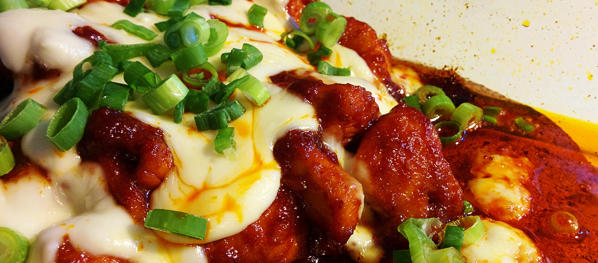

* `2 lzice` tamToho
* `Quantity` Ingredient 2

> Ingredients

___

> Step-by-step cooking instructions.
>
> Final preparation or serving suggestions.

> Additional notes or tips related to the recipe.

---

> **Bold**, *italic*, and ~~strike-through~~ text formatting.
>
> Nested blockquotes for emphasizing certain steps or notes.
>
>>> Inline HTML for additional styling (use sparingly).
>
> Links to additional resources or related recipes.
>
> 
>
> <marquee>Inline HTML, while inelegant (*especially* this tag), works too!</marquee>

## Additional Styling Options
